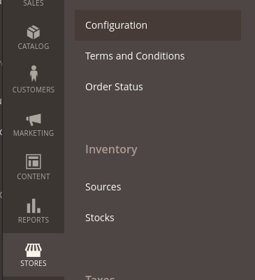

# Installation & Configuration

## Step 1: Install the plugin in Adobe Commerce

Navigate to the root of your project:

1. Plugin retrieval

```sh
composer require upstreampay/payment-magento2
```

2. Activate the plugin

```sh
bin/magento module:enable UpStreamPay_Client UpStreamPay_Core
```

3. Deployment

```sh
bin/magento setup:upgrade
```

4. Clear cache

```sh
bin/magento cache:clear
```

## Step 2: Configure the Adobe Commerce cron

It is important to have the cron active in your project. The cron is responsible for processing webhooks. Without it, orders will remain indefinitely pending payment.

For configuring the cron, refer to the official documentation:
[Adobe Commerce - Configure cron jobs
](https://experienceleague.adobe.com/docs/commerce-operations/configuration-guide/cli/configure-cron-jobs.html)

## Step 3: Plugin configuration

Once you have completed the previous steps, you can log in to the Adobe Commerce administration:

1. **Log in** to the Adobe Commerce administration.

2. In the left navigation, go to **Stores > Configuration**.



3. In the submenu, navigate to Sales > Payment Methods.


4. Expand the UpStreamPay tab.


Verify the following fields:

| Field          | Value                                                                                                                                            |
|----------------|--------------------------------------------------------------------------------------------------------------------------------------------------|
| Enabled        | Yes                                                                                                                                              |
| Payment action | Choose according to your business:<br/>**Authorize only** will require manual capture.<br/>**Immediate capture** will capture after place order. |
| API mode       | Select based on your environment:<br/>Use **sandbox** for development environment<br/>Use **production** when ready to go live.                  |
| Client ID      | Client ID provided by UpStreamPay.                                                                                                               |
| Entity ID      | Entity ID provided by UpStreamPay.                                                                                                               |
| Client secret  | Client Secret provided by UpStreamPay.                                                                                                           |
| API key        | API Key provided by UpStreamPay.                                                                                                                 |

## Uninstallation

Run the command
```sh
composer remove upstreampay/payment-magento2
```