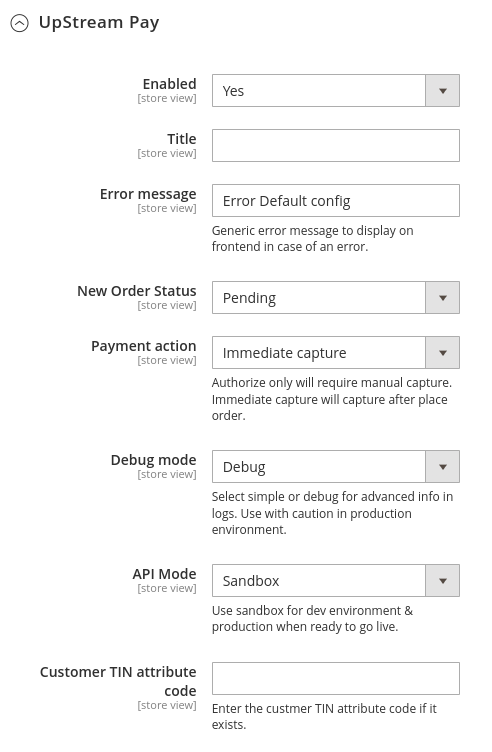
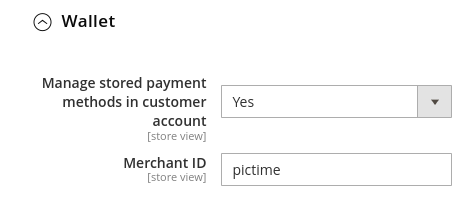
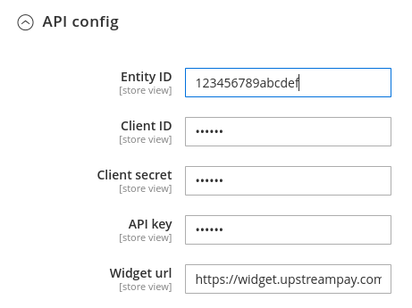
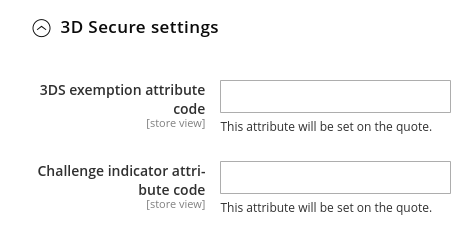
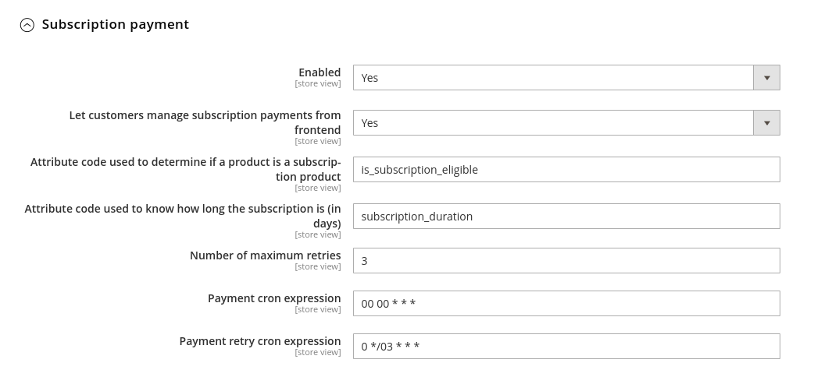

# Plugin Config

You can configure the module in the Adobe Commerce administration by going to **Stores > Configuration > Sales > Payment Methods > UpStreamPay**.

## General

| Parameter                   | Description                                                                                             |
|-----------------------------|---------------------------------------------------------------------------------------------------------|
| Enabled                     | Enable/Disable payment method                                                                           |
| Title                       | Label displayed in checkout                                                                             |
| Error message               | Generic error message to display on frontend in case of error.                                          |
| New order status            | Initial status for new orders                                                                           |
| Payment action              | **Authorize only** **Immediate capture** **Authorize only** See below                           |
| Debug mode                  | **Disabled**: Logs transactions only.  **Simple**: Logs events.  **Debug**: Logs all API calls. |
| API mode                    | Use **sandbox** for development environment. Use **production** for production environment.         |
| Customer TIN attribute code | Customer Attribute (non static) name containing the Tax Identification Number                           |

### Payments modes

**Authorize Only**: The plugin will not perform payment capture. This will remain the responsibility of the seller.

**Immediat Capture**: To use the Immediat Capture (or Direct Debit) mode, you need to modify ALL payment methods from the UpStreamPay administration to Immediat Capture mode. The plugin does not perform Immediat Capture itself.

**Order**: The plugin will automatically perform the payment capture upon invoicing.

### Currency used

By default, the plugin uses the currency configured at the Website level. It is not possible to have stores with different currencies.

If you want to have different currencies in the same Adobe Commerce application, you will need to create multiple Websites.

### Debug mode

**Disabled**: Log only transaction and payment, searchable in the administration at: **Sales > Payments Listing** and **Sales > Transactions listing**

**Simple**: Log all payment and transaction events in the `upstreampay_notify.log` file.

> :warning: To be used with caution in production environments.

**Debug**: Log all API calls in the log files and save them in `upstreampay_api.log` file. 
> :warning: Generates a large amount of data. To be used with extreme caution in production environments.

## WALLET

| Parameter                                         | Description                                  |
|---------------------------------------------------|----------------------------------------------|
| Manage stored payment methods in customer account | Let the customer manage his payment methods. |
| Merchant ID                                       | Merchant ID, mandatory field.                |

By default the config is set to No & no merchant ID is provided. As soon as the config is set to Yes, then
the merchant ID config becomes visible & required in admin.

## API

| Parameter     | Description                              |
|---------------|------------------------------------------|
| Entity ID     | Entity ID provided by UpStreamPay.       |
| Client ID     | Client ID provided by UpStreamPay.       |
| Client secret | Client Secret provided by UpStreamPay.   |
| API key       | API Key provided by UpStreamPay.         |
| Widget url    | URL using for include widget if specific |

## 3D Secure settings

| Parameter                          | Description                                                   |
|------------------------------------|---------------------------------------------------------------|
| 3DS exemption attribute code       | Quote attribute name using for 3DS exemption                  |
| Challenge indicator attribute code | Quote attribute name using for 3DS challenge indicator (rate) |

These parameters represent the names of the attributes (non static) to be transmitted to the payment provider to exempt a
cart or provide a note. The creation and content of these attributes are the responsibility of the store if it has them.

## Subscription settings

| Parameter                                                               | Description                                                                                                |
|-------------------------------------------------------------------------|------------------------------------------------------------------------------------------------------------|
| Enabled                                                                 | Enable / Disable the subscription (recurring payments) feature.                                            |
| Let customers manage subscription  payments from frontend           | Enable / Disable the frontend customer account interface.                                                  |
| Attribute code used to determine if a product is a subscription product | Attribute code (int attribute) to determine if product is a subscription                                   |
| Attribute code used to know how long the subscription is (in days)      | Attribute code (int attribute) to determine the number of days for the subscription                        |
| Payment cron expression                                                 | The subscription payment renewal cron expression **(run ONCE a day !!!!)**.                                |
| Payment retry cron expression                                           | The retry payment cron expression. Each time this cron runs it adds +1 to the retry counter of the payment |
