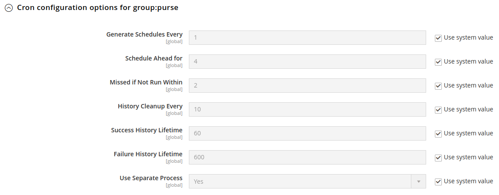

# Plugin Cron

You can configure the cron task features in the Adobe Commerce administration by going to **Stores > Configuration > Sales > Payment Methods > UpStreamPay > Recurring payment**.

## General

### Subscriptions cron
The cron `subscription_payment` is used to renew the subscriptions for today's date.

**This cron must run ONCE daily, there is no need to run it more than once a day & you cannot skip a day.**

To be eligible to a renewal, a subscription must:
- have the next payment date set to today's date.
- have the payment status set to `to_pay`.
- have the subscription status set to `disabled`.
- have the order id set to `null`.

The class used for the cron is `UpStreamPay\Core\Cron\SubscriptionPaymentExecution`.

If you'd like to run an external cron to run the command & disable this one you can.

### Subscriptions retry cron
The cron `subscription_payment_retry` is used to retry the subscriptions payment. Each time it is triggered a retry
on the payment in error will be done.

**This cron can run as much as you'd like per day. But avoid running it too often, give it at least 30 minutes / 1 hour
between each run.**

To be eligible a retry must:
- have the `error` status.
- have a number of retry < to the maximum number of retry.

The class used for the cron is `UpStreamPay\Core\Cron\SubscriptionPaymentRetryExecution`.

If you'd like to run an external cron to run the command & disable this one you can.

## Cron group

You can configure the cron group by going to **Stores > Configuration > Advanced > System**

Under this tab you can retrieve cron groups configuration :

| Parameter                  | Description                                                                                                      |
|----------------------------|------------------------------------------------------------------------------------------------------------------|
| `schedule_generate_every`  | Frequency (in minutes) that schedules are written to the `cron_schedule` table.                                  |
| `schedule_ahead_for`       | Time (in minutes) in advance that schedules are written to the `cron_schedule` table.                            |
| `schedule_lifetime`        | Window of time (in minutes) that a cron job must start or the cron job is considered missed (“too late” to run). |
| `history_cleanup_every`    | Time (in minutes) that cron history is kept in the database.                                                     |
| `history_success_lifetime` | Time (in minutes) that the record of successfully completed cron jobs is kept in the database.                   |
| `history_failure_lifetime` | Time (in minutes) that the record of failed cron jobs is kept in the database.                                   |
| `use_separate_process`     | Run this cron group’s jobs in a separate php process                                                             |
